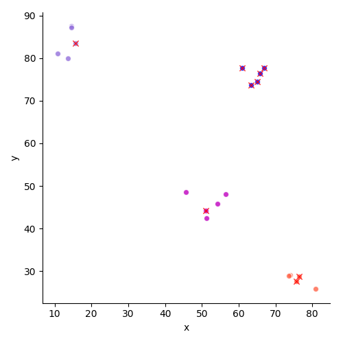

# DBSCAN

[](https://travis-ci.org/gbroques/dbscan)
[](https://coveralls.io/github/gbroques/dbscan?branch=master)

Density-Based Spatial Clustering of Applications with Noise (DBSCAN) implementation in Python.

API inspired by Scikit-learn.

## Usage

```python
import numpy as np

from dataviz import generate_clusters
from dataviz import plot_clusters
from dbscan import DBSCAN

def generate_data(num_clusters: int, seed=None) -> np.ndarray:
    num_points = 20
    spread = 7
    bounds = (1, 100)
    clusters = generate_clusters(num_clusters, num_points, spread, bounds, bounds, seed)
    return np.array(clusters)

num_clusters = 4
clusters = generate_data(num_clusters, seed=1)
dbscan = DBSCAN(eps=7, min_samples=5)
dbscan.fit(clusters)
plot_clusters(clusters, dbscan.labels_, dbscan.components_)
```



* Red crosses denote **core points**

**Reference:**  *Introduction to Data Mining* (1st Edition) by Pang-Ning Tan
Section 8.4, Page 526

**Original Paper:** Ester, Martin, Hans-Peter Kriegel, Jörg Sander, and Xiaowei Xu. "A density-based algorithm for discovering clusters in large spatial databases with noise." In Kdd, vol. 96, no. 34, pp. 226-231. 1996.

